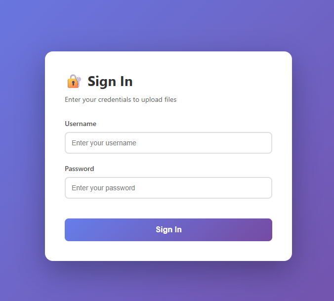
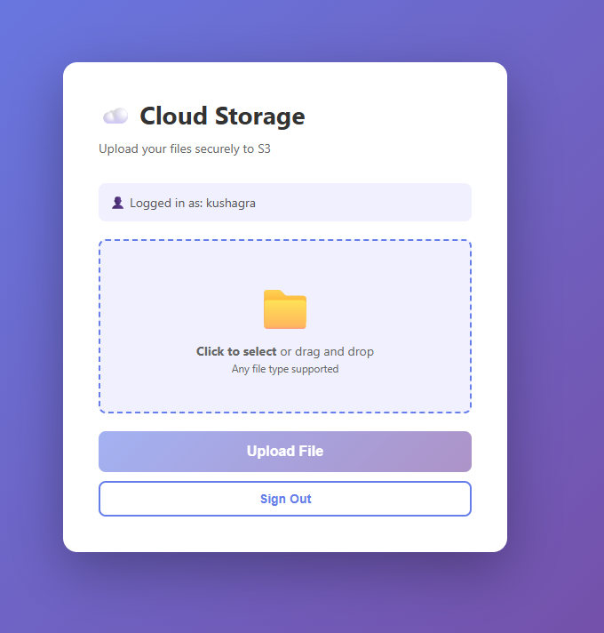
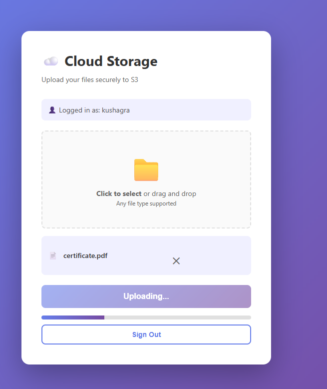
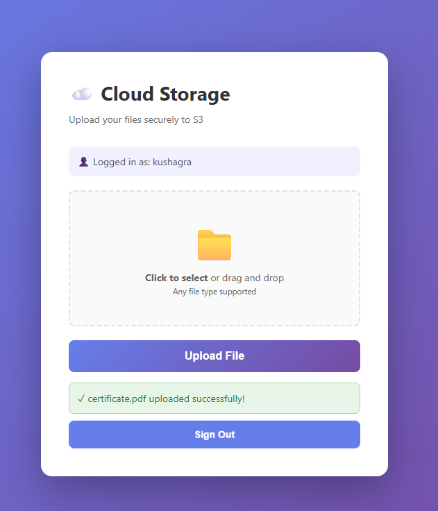

# Secure Cloud File Storage System

## Problem Statement

In today's digital landscape, organizations and individuals need a reliable, scalable, and secure way to store and manage files. Traditional file storage solutions often lack:
- **Scalability**: Limited storage capacity requiring expensive hardware upgrades
- **Security**: Inadequate access controls and encryption
- **Accessibility**: Difficulty accessing files from multiple locations
- **Cost-effectiveness**: High maintenance costs for on-premise storage

This project addresses these challenges by building a cloud-based file storage system that leverages AWS S3 for object storage, providing:
- Unlimited scalable storage
- Secure file uploads with presigned URLs
- User authentication and authorization
- Direct browser-to-S3 uploads (reducing server load)
- Cost-effective pay-as-you-go pricing model

## Architecture Overview

The application follows a three-tier architecture:

1. **Frontend Layer**: HTML/JavaScript single-page application
2. **Backend Layer**: Django REST API with JWT authentication
3. **Storage Layer**: AWS S3 for object storage

**Key Components:**
- **User Authentication**: JWT-based authentication system
- **Presigned URLs**: Secure, temporary URLs for direct S3 uploads
- **Database**: SQLite for storing file metadata (user, filename, S3 key)
- **Direct Upload**: Files upload directly from browser to S3, bypassing the server

**Architecture Diagram:**
```
┌─────────────┐         ┌──────────────┐         ┌─────────────┐
│   Browser   │────────▶│ Django REST  │────────▶│  SQLite DB  │
│  (Frontend) │◀────────│     API      │◀────────│ (Metadata)  │
└─────────────┘         └──────────────┘         └─────────────┘
       │                       │
       │                       ▼
       │                ┌──────────────┐
       └───────────────▶│   AWS S3     │
         Direct Upload  │   Bucket     │
                        └──────────────┘
```

## AWS Services Used

### 1. **Amazon S3 (Simple Storage Service)**
   - **Purpose**: Primary object storage for uploaded files
   - **Features Used**:
     - Presigned URLs for secure, temporary access
     - CORS configuration for browser uploads
     - Bucket policies for access control
   - **Why S3**: 
     - 99.999999999% durability
     - Unlimited scalability
     - Pay-per-use pricing
     - Built-in redundancy

### 2. **AWS IAM (Identity and Access Management)**
   - **Purpose**: Manage access credentials and permissions
   - **Features Used**:
     - IAM user with programmatic access
     - S3 specific permissions (PutObject, GetObject)
     - Access keys for API authentication
   - **Security**: Follows principle of least privilege

## Deployment Steps

### Prerequisites
- Python 3.8 or higher
- AWS Account with S3 access
- Git installed
- Modern web browser

### Step 1: Clone the Repository
```bash
git clone <repository-url>
cd Team-YourTeamName/beginner/cloud-file-storage
```

### Step 2: Set Up AWS Resources

#### Create S3 Bucket
1. Login to AWS Console → S3
2. Click "Create bucket"
3. Enter bucket name (e.g., `your-team-file-storage`)
4. Select region (e.g., `us-east-1`)
5. Keep default settings and create bucket

#### Configure S3 CORS
1. Go to your bucket → Permissions → CORS
2. Add this configuration:
```json
[
    {
        "AllowedHeaders": ["*"],
        "AllowedMethods": ["GET", "PUT", "POST", "DELETE", "HEAD"],
        "AllowedOrigins": ["*"],
        "ExposeHeaders": ["ETag"],
        "MaxAgeSeconds": 3000
    }
]
```

#### Create IAM User
1. AWS Console → IAM → Users → Add user
2. User name: `file-storage-app`
3. Enable: "Programmatic access"
4. Attach policy: `AmazonS3FullAccess` (or custom policy)
5. Save Access Key ID and Secret Access Key

### Step 3: Backend Setup

```bash
# Navigate to source directory
cd src/backend

# Create virtual environment
python -m venv venv

# Activate virtual environment
# Windows:
venv\Scripts\activate
# Linux/Mac:
source venv/bin/activate

# Install dependencies
pip install -r requirements.txt

# Create .env file
cat > .env << EOF
AWS_ACCESS_KEY_ID=your_access_key_here
AWS_SECRET_ACCESS_KEY=your_secret_key_here
AWS_STORAGE_BUCKET_NAME=your-bucket-name
AWS_S3_REGION_NAME=us-east-1
EOF

# Run migrations
python manage.py makemigrations
python manage.py migrate

# Create superuser
python manage.py createsuperuser
# Enter username: admin
# Enter password: (your secure password)

# Start server
python manage.py runserver
```

### Step 4: Frontend Setup

```bash
# In a new terminal, navigate to frontend
cd src/frontend

# Update API URL in upload_page.html (line ~263)
# Change: const API_BASE_URL = 'http://localhost:8000/api';

# Open in browser
# Simply open upload_page.html in any web browser
# Or serve via Python:
python -m http.server 8080
# Then visit: http://localhost:8080/upload_page.html
```

### Step 5: Test the Application

1. Open `upload_page.html` in browser
2. Login with superuser credentials
3. Select a file to upload
4. Click "Upload File"
5. Verify file appears in S3 bucket
6. Check database for metadata

### Step 6: Verify Deployment

```bash
# Test authentication
curl -X POST http://localhost:8000/api/token/ \
  -H "Content-Type: application/json" \
  -d '{"username":"admin","password":"yourpassword"}'

# Expected: {"access":"...", "refresh":"..."}

# Test file listing (with token from above)
curl http://localhost:8000/api/files/ \
  -H "Authorization: Bearer YOUR_ACCESS_TOKEN"

# Check S3 bucket
aws s3 ls s3://your-bucket-name/
```

## Security Considerations

### 1. **Authentication & Authorization**
   - ✅ JWT-based authentication with token expiry
   - ✅ User-based access control (users can only see their own files)
   - ✅ Password hashing using Django's built-in system
   - ⚠️ **Production**: Use HTTPS, set DEBUG=False, change SECRET_KEY

### 2. **AWS Credentials Protection**
   - ✅ Credentials stored in `.env` file (not in code)
   - ✅ `.env` added to `.gitignore`
   - ⚠️ **Production**: Use AWS IAM roles instead of access keys
   - ⚠️ **Best Practice**: Rotate credentials regularly

### 3. **Presigned URLs**
   - ✅ Temporary URLs (5-minute expiry)
   - ✅ Specific to single file and operation (PUT only)
   - ✅ No permanent public access to S3 objects
   - ℹ️ URLs expire automatically after use or timeout

### 4. **CORS Configuration**
   - ⚠️ Currently allows all origins (`*`) for development
   - 🔒 **Production**: Restrict to specific domains
   ```json
   "AllowedOrigins" : ["https://yourdomain.com"]
   ```

### 5. **Input Validation**
   - ✅ File type validation on backend
   - ✅ Unique filename generation (UUID prefix)
   - ⚠️ **Enhancement**: Add file size limits
   - ⚠️ **Enhancement**: Validate file content (not just extension)

### 6. **Network Security**
   - ✅ HTTPS for S3 communication (built-in)
   - ⚠️ **Production**: Enable HTTPS for Django (use nginx/SSL)
   - ⚠️ **Production**: Set proper ALLOWED_HOSTS

### 7. **Database Security**
   - ✅ SQL injection protected (Django ORM)
   - ✅ User passwords hashed
   - ⚠️ **Production**: Use PostgreSQL/MySQL instead of SQLite

### 8. **S3 Bucket Security**
   - ✅ Block public access enabled
   - ✅ Only authenticated uploads allowed
   - ⚠️ **Enhancement**: Enable bucket encryption
   - ⚠️ **Enhancement**: Enable versioning for file recovery
   - ⚠️ **Enhancement**: Set lifecycle policies for cost optimization

### Security Checklist for Production:
- [ ] Change Django SECRET_KEY
- [ ] Set DEBUG = False
- [ ] Configure ALLOWED_HOSTS
- [ ] Use HTTPS (SSL/TLS)
- [ ] Restrict CORS to specific domains
- [ ] Enable S3 bucket encryption
- [ ] Use IAM roles instead of access keys
- [ ] Implement rate limiting
- [ ] Add file size restrictions
- [ ] Enable CloudWatch logging
- [ ] Set up AWS WAF for DDoS protection

## Challenges Faced

### 1. **CORS Configuration Issues**
   - **Challenge**: Browser blocked direct S3 uploads with CORS errors
   - **Root Cause**: S3 bucket didn't have CORS policy configured
   - **Solution**: Added CORS configuration to S3 bucket allowing PUT requests from browser
   - **Learning**: CORS must be configured on both Django (for API) and S3 (for uploads)

### 2. **Presigned URL Generation**
   - **Challenge**: Understanding presigned URL parameters and expiry
   - **Issue**: Initially set too short expiry causing upload failures
   - **Solution**: Set appropriate 5-minute expiry with proper ContentType
   - **Learning**: Presigned URLs must include all parameters that will be used in the actual request

### 3. **JWT Token Management**
   - **Challenge**: Token expiry causing repeated login requirements
   - **Solution**: Implemented localStorage for token persistence
   - **Enhancement Needed**: Implement token refresh mechanism
   - **Learning**: Balance between security (short expiry) and UX (token refresh)

### 4. **File Metadata Synchronization**
   - **Challenge**: Ensuring database and S3 stay synchronized
   - **Issue**: What if S3 upload succeeds but database save fails?
   - **Current Solution**: Save metadata before S3 upload
   - **Better Approach**: Implement transaction rollback or cleanup jobs

### 5. **Environment Configuration**
   - **Challenge**: Managing different configs for dev/prod
   - **Issue**: Hardcoded URLs and settings
   - **Solution**: Used .env files and environment variables
   - **Learning**: Never commit credentials or environment-specific configs

### 6. **Direct Upload Architecture**
   - **Challenge**: Understanding why direct upload is better than proxying
   - **Benefit**: Reduces server load, faster uploads, scalability
   - **Trade-off**: More complex frontend logic
   - **Learning**: Cloud-native patterns differ from traditional architectures

### 7. **File Name Collision**
   - **Challenge**: Multiple users uploading files with same name
   - **Solution**: Prepend UUID to all filenames
   - **Alternative Considered**: Use user folders structure
   - **Learning**: Always plan for concurrent users and edge cases

## Key Learnings

### Technical Learnings

1. **Cloud Storage Architecture**
   - Learned difference between object storage (S3) vs block/file storage
   - Understanding of presigned URLs for secure, temporary access
   - How to leverage CDN capabilities of S3 for content delivery

2. **Authentication & Security**
   - JWT tokens provide stateless authentication
   - Importance of least-privilege access in IAM
   - Multiple layers of security (auth, presigned URLs, CORS)

3. **Django REST Framework**
   - Building RESTful APIs with Django
   - Custom permissions and authentication classes
   - Serializers for data validation

4. **AWS Services Integration**
   - boto3 library for AWS SDK in Python
   - IAM roles vs access keys
   - S3 bucket policies and CORS configuration

5. **Frontend-Backend Separation**
   - API-first design approach
   - CORS and cross-origin requests
   - JWT token management in browser

### Best Practices Learned

1. **Never store credentials in code** - Use environment variables
2. **Implement proper error handling** - User-friendly messages, logging
3. **Validate on both client and server** - Defense in depth
4. **Use unique identifiers** - Prevent naming conflicts
5. **Document everything** - Makes deployment and maintenance easier
6. **Think about scalability** - Direct S3 uploads reduce server bottleneck
7. **Security by default** - Block public access, use encryption
8. **Test each component** - Backend API, S3 access, frontend separately

### AWS-Specific Learnings

1. **S3 is not a file system** - It's object storage with different semantics
2. **Presigned URLs** - Powerful pattern for delegating temporary access
3. **IAM policies** - Complex but necessary for fine-grained control
4. **CORS in cloud** - Both API and storage need CORS configuration
5. **Pay-per-use model** - Understand pricing for storage, requests, data transfer

### Challenges That Made Us Better

1. **Debugging CORS issues** - Taught us about browser security and network inspection
2. **Token expiry handling** - Made us think about session management
3. **File upload failures** - Learned importance of progress feedback and error recovery
4. **Documentation writing** - Improved technical communication skills

### What We'd Do Differently

1. **Add file encryption** - Encrypt files before upload for extra security
2. **Implement file sharing** - Allow users to share files with others
3. **Add file preview** - Preview images/PDFs before download
4. **Progress indicator** - Real-time upload progress from S3
5. **Batch uploads** - Upload multiple files simultaneously
6. **File organization** - Folders/tags for better organization
7. **Search functionality** - Search through uploaded files
8. **Monitoring** - Add CloudWatch metrics and alerts

### Impact & Value

- **Scalability**: Supports unlimited files and users
- **Cost-Effective**: Pay only for storage used
- **Performance**: Direct uploads faster than proxying through server
- **Availability**: 99.99% uptime SLA from AWS
- **Security**: Multiple layers of protection

## Screenshots

### 1. Login Screen

*User authentication with JWT tokens*

### 2. File Upload Interface

*Drag-and-drop or click to select files*

### 3. Upload Progress

*Real-time upload progress indicator*

### 4. Success Message

*Confirmation after successful upload*

### 5. AWS S3 Bucket

*Files stored in S3 bucket*


## Demo Video 

- You can access video in the /demo video
---

## Additional Information

### Team Members
- Member 1:  Ojasvi Marwari
- Member 2:  Kushagra Verma
- Member 3:  Krishna Gupta
- Member 4:  Manas Mayank Verma

### Repository Structure
```
beginner/
└── cloud-file-storage/
    ├── README.md (this file)
    ├── architecture.png
    ├── screenshots/
    │   ├── login.png
    │   ├── upload.png
    │   └── ...
    └── src/
        ├── backend/
        │   ├── cloudstorage/
        │   ├── uploads/
        │   ├── manage.py
        │   ├── requirements.txt
        │   └── .env.example
        └── frontend/
            ├── upload_page.html
            └── diagnostic_page.html
```

### Dependencies
```
Django==6.0.2
djangorestframework==3.14.0
djangorestframework-simplejwt==5.3.1
django-cors-headers==4.3.1
boto3==1.34.34
python-dotenv==1.0.0
```

### License
MIT License - Free to use and modify


**Last Updated**: February 2026